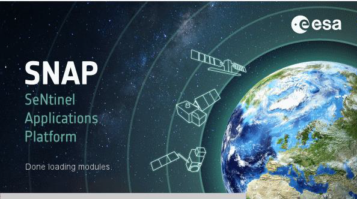

<h1>Introducción al uso de imágenes de Radar de Apertura Sintética aplicado a la agricultura</h1> 
<h2>Manual de cálculo de inundaciones</h2> 

Este manual fue elaborado por la Escuela de Geografía de la Universidad de Costa Rica, para el cual colaboraron Emmanuel Jesús Céspedes-Rivera y Cristian Aguilar-Barboza en calidad de asistentes avanzados del proyecto "Transformación digital: Incorporación de tecnología SAR en la gestión de riesgos, agricultura y recursos naturales para Centroamérica", en el marco del proyecto UCREA-IICA.

Este proyecto está coordinado por el Dr Edgar Espinoza Cisneros y co-cordinado por MSc María José Molina Montero. Para mayor información contactar a maria.molinamontero@ucr.ac.cr .

Índice
 

<li><a href="#Sección1">1. Prerrequisitos</a></li>
<li><a href="#Sección2">2. Introducción</a></li>
<li><a href="#Sección3">3. Pre-procesamiento</a></li>
<li><a href="#Sección4">4. Procesamiento para detección de inundaciones</a></li>
<li><a href="#Sección5">5. Recomendaciones</a></li>
<li><a href="#Sección7">6. Bibliografía</a></li>
 

Para ejecutar esta rutina el usuario debe instalar previamente el software Sentinel Toolbox (SNAP), el cual es un software de procesamiento para el análisis y observación de la tierra, con herramientas enfocadas en extensibilidad de datos, portabilidad, procesamiento en marcos gráficos, entre otras herramientas (ESA, 2020).

<h4 id="Sección3">Fig. 1. Sentinel Toolbox (SNAP).</h4>

La descarga del software SNAP se puede realizar en la siguiente dirección electrónica
 

<a href="http://step.esa.int/main/download/snap-download/" target="_blank">http://step.esa.int/main/download/snap-download/</a>
 

Los requisitos computacionales mínimos son:
<li>Sistema operativo: Linux, Mac, Windows.</li>
<li>RAM: 8 GB Procesador Intel® Core™ i5-5 o sus equivalentes.</li>
<li>Espacio en disco mínimo 5GB</li>

<h2 id="Sección2">2. Introducción</h2>

La información confiable sobre la distribución espacial de las aguas superficiales es de importancia crítica en varias disciplinas científicas. El Radar de Apertura Sintética (SAR por sus siglas en inglés) es una forma efectiva de detectar inundaciones y monitorear cuerpos de agua en grandes áreas. Sentinel-1 es un nuevo SAR en banda-C disponible, que dada su resolución espacial y líneas de base temporal cortas, tienen el potencial de facilitar el monitoreo de los cambios en las aguas superficiales, que son dinámicos en el espacio y el tiempo.

Cabe destacar que la detección remota con sensores ópticos requieren de observaciones con productos de buena calidad, sin nubes o sombras de nubes para minimizar la confusión espectral de los datos (Shen et al., 2019), sin embargo, en zonas tropicales como el caso del área de estudio seleccionada, donde las coberturas nubosas son constantes y abundantes, su aplicación resulta limitada (Flores et al., 2019). Debido a este aspecto, se ha implementado el uso de la imágenes SAR, la cual despeja la limitante de la nubosidad y permite la obtención continua de información (Flores et al., 2019).

Se aplicó una metodología de detección de cambio y umbral para determinar inundaciones de 2 imágenes de SAR del sensor Sentinel-1 de la Agencia Espacial Europea (ESA por sus siglas en inglés). Se procesó la polarización VV, ya que esta presenta resultados de inundación más plausibles en este sensor (Clement. et al,. 2017).Se consideró como área de estudio la zona cercana a la llanura de inundación del Río Tempisque durante la tormenta tropical Nate, sucedido en entre el 4-11 de octubre de 2017.

<h3>2.1 Objetivos de aprendizaje:</h3>

<li>Comprender los pre-procesos de calibración de las imágenes SAR.</li>
<li>Describir los procesos de interacción de la señal SAR con la superficie terrestre.</li>
<li>Identificar ventajas y desventajas del uso de imágenes SAR en la detección de inundaciones.</li>
<li>Generar un mapa de inundaciones.</li>

<h3>2.2 Datos a dercargar</h3>

Se deben descargar dos imágenes de tipo GRD de Sentinel-1, estas se pueden obtener de forma gratuita en los siguientes enlaces:

Para ambos casos (Alaska Satellite Facility Vertex y Copernicus Open Access Hub) debe crear -en caso de no tenerse- una cuenta de acceso, para poder descargar datos de información satelital de los repositorios.

<h4>Alaska Satellite Facility Vertex</h4> 

Buscador de datos:
<a href="https://search.asf.alaska.edu/#/" target="_blank">https://search.asf.alaska.edu/#/</a>

Registro de cuenta:
<a href="https://urs.earthdata.nasa.gov/users/new" target="_blank">https://urs.earthdata.nasa.gov/users/new</a>

<h4>Copernicus Open Access Hub</h4>  

Buscador de datos:
<a href="https://scihub.copernicus.eu/dhus/#/home" target="_blank">https://scihub.copernicus.eu/dhus/#/home</a>

Registro de cuenta:
 <a href="https://scihub.copernicus.eu/dhus/#/self-registration" target="_blank">https://scihub.copernicus.eu/dhus/#/self-registration</a>

<h4>Conjunto de datos</h4>

<table style="width:100%">
  <tr>
    <th>Nombre del producto</th>
    <th>Fecha</th> 
    <th>Características</th>
  </tr>
  <tr>
    <td>S1A_IW_GRDH_1SDV_20170918T113029_20170918T113054_018429_01F07D_BCA3</td>
    <td>2017/09/18</td>
    <td>
Sentinel-1A

Polarización VV, VH

Órbita: Descendente

Modo: IW

Tipo: GRDH
</td>
  </tr>
  <tr>
    <td>S1A_IW_GRDH_1SDV_20171012T113030_20171012T113055_018779_01FB2A_7C27</td>
    <td>22017/10/12</td>
    <td>
Sentinel-1A

Polarización VV, VH

Órbita: Descendente

Modo: IW

Tipo: GRDH
</td>
  </tr>
</table>

<h2 id="Sección3">3. Pre-procesamiento</h2>

<h3>3.1 Importar imágenes del repositorio a SNAP.</h3>

Las imágenes descargadas se guardan como un archivo comprimido, estas no deben ser descomprimidas, ya que el SNAP interpreta la información en ese formato.
Use la opción <strong>File/ Open Product</strong> para importar las imágenes SAR del repositorio donde se encuentran los archivos RAR descargados.

<h4 id="Sección2">Fig 2. Importar imágenes del repositorio.</h4>
